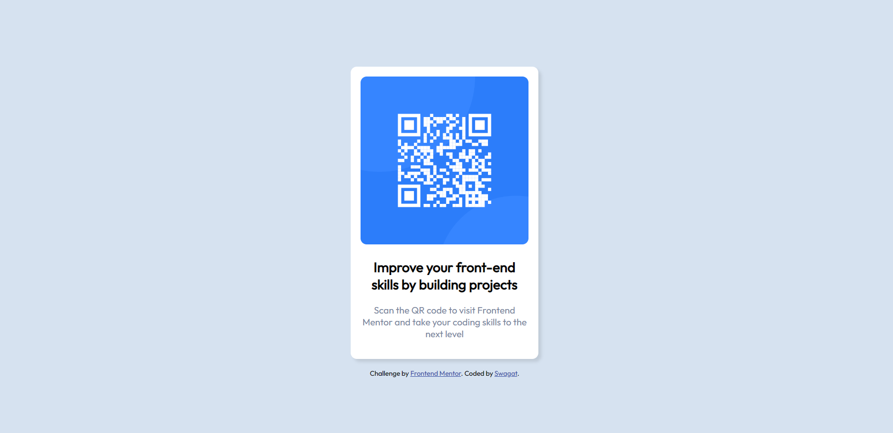

# Frontend Mentor - QR code component solution

This is a solution to the [QR code component challenge on Frontend Mentor](https://www.frontendmentor.io/challenges/qr-code-component-iux_sIO_H). Frontend Mentor challenges help you improve your coding skills by building realistic projects. 

## Table of contents

- [Overview](#overview)
  - [Screenshot](#screenshot)
  - [Links](#links)
- [My process](#my-process)
  - [Built with](#built-with)
  - [What I learned](#what-i-learned)
  - [Continued development](#continued-development)
  - [Useful resources](#useful-resources)
- [Author](#author)

**Note: Delete this note and update the table of contents based on what sections you keep.**

## Overview

### Screenshot




### Links

- Solution URL: [Add solution URL here](https://your-solution-url.com)
- Live Site URL: http://127.0.0.1:5500/qr-code-component-main/index.html

## My process

### Built with

- Semantic HTML5 markup
- CSS custom properties
- Flexbox
- CSS Grid

### What I learned

```css
.body {
    background-color: hsl(212, 45%, 89%);
    font-size: 15px;
    font-family: 'Outfit', sans-serif;
    display: flex;
    flex-direction: column;
    align-items: center;
    justify-content: center;
    height: 100vh;
}

This section helped me center the main content.

### Continued development

I am trying to focus on learning css grid anf flexbox in detail.

## Author

- Website - [Swagat Khodkumbhe](https://github.com/Swagat-K04)
- Frontend Mentor - [@Swagat-K04](https://www.frontendmentor.io/profile/Swagat-K04)
- Twitter - [@Swagat_K04](https://twitter.com/Swagat_K04)


